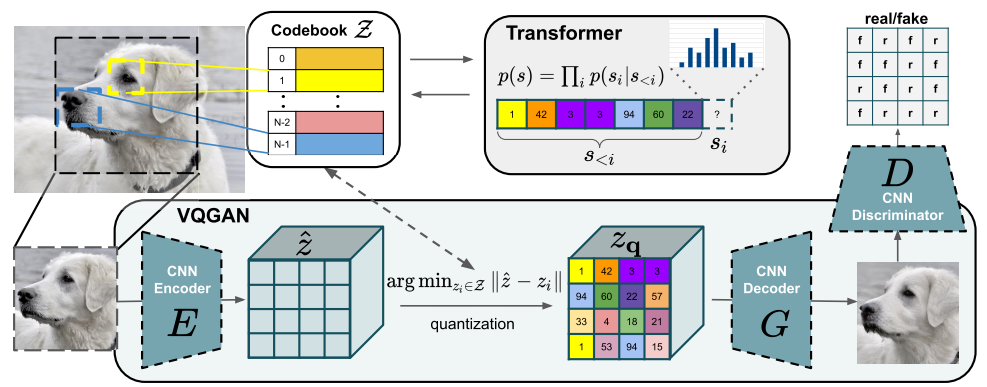
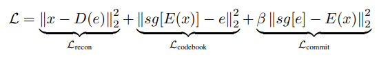

# Transformer-based synthetic video generator
- Generate synthetic video data using a transformer-based architercture
  - Auto-gressive sampling is a bottleneck, can we do differently
  - Using the learned simulator for training driving models
  - Scaling to more bits and larger transformer when sampling is not the bottleneck
  - Better video tokenizer
  - Since our goal is to compress video and not generate high-fidelity ones, a VQ-VAE will do the job
  - Deal with spatio-temporal consistency

# First we will be implementing a VQ-VAE

# Look at the VQ-VAE loss

- The VQ-VAE learns to compress and decompress videos by maximizing the variational lower bound
    -That is, to minimize error between compression and decompression + minimizing the error of the codebook-encoded_vector
    - Finally, the goal is to minimize the KL-divergence ratio, that is to prevent the encoder and decoder's data distribution from diverging from each other.
